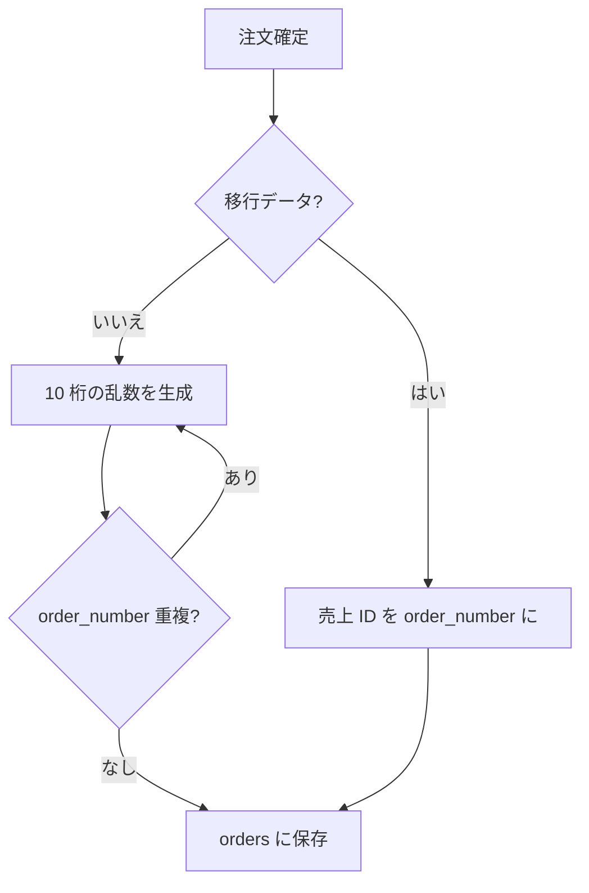
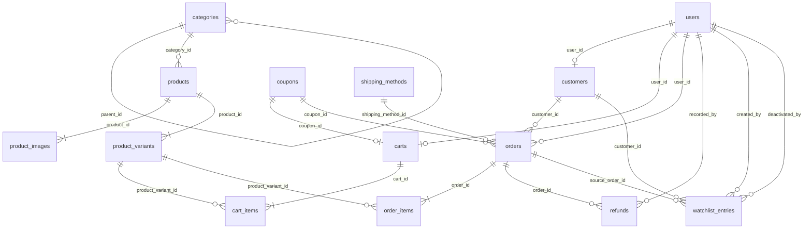

# データベース仕様書

> **ステータス: 確定**（v0.46 / 2026-06-25）
>
> テーブル定義の詳細は [テーブル定義書](./table-definition.md) を参照。

## ドキュメント情報

| 項目 | 内容 |
|------|------|
| プロジェクト名 | いおり書房 EC サイト（iorishobo） |
| DBMS | MySQL 8.x |
| 関連ドキュメント | [テーブル定義書](./table-definition.md) |
| バージョン | 0.46（確定） |
| 最終更新日 | 2026-06-25 |

---

## 1. 設計の前提

| 項目 | 方針 |
|------|------|
| 移行元 | カラーミーショップ |
| 商品数 | 約 72 品目（親商品＋オプション組み合わせ含む） |
| 決済 | Stripe・代金引換・銀行振込（**Amazon Pay は新サイトでは廃止**。過去注文は移行のみ） |
| 会員 | ゲスト購入可 + 任意ログイン（**顧客マスタは会員・非会員とも保持**。§3.20） |
| 配送 | クリックポスト系 / ゆうパック（**全国一律送料**） |
| データ移行 | 商品・顧客・注文を CSV から移行 |
| 旧 URL | カラーミー商品 ID（`?pid=`）→ `/products/{slug}` へ 301。`slug` は ID ベース（§3.21） |
| 金額 | 整数・円単位・税込（内税・小数不使用） |
| 消費税 | **10% 固定**・全商品同一・軽減税率なし |
| 文字コード・照合順序 | `utf8mb4` / `utf8mb4_unicode_ci` |
| タイムゾーン | **Asia/Tokyo**（アプリ。移行 CSV の日時も JST として取り込む） |

---

## 2. カラーミーデータの分析

設計は **エクスポート CSV の実データ** に基づく。推測で項目を省略しない。

リポジトリ内の CSV は **分析用サンプル**（件数は少ない）。本番移行は顧客・注文とも **数千件規模** を想定する。

### 2.1 商品（product.csv）

- 72 行（1 行 = 1 親商品）
- 大カテゴリー / 小カテゴリーの 2 階層
- JAN/ISBN、重量、個別送料、掲載設定など 60 列
- 在庫は **一部の商品のみ** 管理する（多くは在庫管理しない）

### 2.2 オプション（option_csv_download_*.csv）

| パターン | 例 |
|---------|-----|
| 1 軸（学年） | １年生 / ２年生 / ３年生 |
| 2 軸（学年 × 教科書準拠） | １年生 × 東京書籍 |
| 1 軸（科目） | 代数1 / 平面2 |

各選択肢に **独自の colorme_option_id と価格** がある。

### 2.3 顧客（customer.csv）— 実データの確認

※ 以下の件数は **サンプル CSV** の値。本番は数千件想定（§2 冒頭）。

| 項目 | サンプル 3 件での空欄 |
|------|---------------------|
| 名前 | 0 / 3 |
| フリガナ | 0 / 3（移行データにはあるが **新規入力では任意**） |
| 郵便番号・都道府県・住所 | 0 / 3 |
| 電話番号 | 1 / 3 |
| 携帯番号 | 1 / 3 |
| FAX | 3 / 3（**常に空 → 新設計では持たない**） |

`customer.csv` には [公式ヘルプ](https://help.shop-pro.jp/hc/ja/articles/360062479334) どおり **「ユーザー登録」** 列がある（会員登録の有無。「有」「無」）。移行ルールは §3.20。

カラーミーの住所形式:

```
都道府県名: 群馬県          ← 別列
住所:       高崎市下和田町4-4-4   ← 市区町村 + 番地が 1 列に結合
```

別例（建物名あり）:

```
都道府県名: 神奈川県
住所:       横浜市青葉区藤が丘 2-37-10　オトゥール藤が丘 403
```

→ サイト入力は **住所 + 建物名の 2 列** だが、**sales_all.csv / customer.csv では `住所` 1 列に結合** されて出力される（[ヘルプ：受注一括データ](https://help.shop-pro.jp/hc/ja/articles/360062479334)）。  
ヤマト等の配送 CSV では **お届け先住所 + お届け先建物名** が別列。

### 2.5 住所項目の整理（サイト vs CSV）

| レイヤ | 住所の持ち方 |
|--------|-------------|
| **購入フォーム** | 郵便番号 + 都道府県 + **住所（address1）** + **建物名（address2・任意）** |
| **sales_all.csv** | 郵便番号 + 都道府県 + **住所 1 列**（建物名込みで結合されることあり） |
| **customer.csv** | 同上 |
| **ヤマト配送 CSV** | お届け先住所 + お届け先建物名（2 列） |

Laravel の DB 列は **購入フォーム（address1/address2）に合わせる**。city / street への 5 分割は行わない。

---

### 2.4 注文（sales_all.csv）— 実データの確認

※ 以下の「4 注文」等は **サンプル CSV** の値。本番は数千件想定（§2 冒頭）。

| 項目 | 内容 |
|------|------|
| 購入者 | 名前・郵便番号・都道府県・住所・メール・電話・携帯（**フリガナ列なし**） |
| 配送先 | 名前・**フリガナ（任意）**・郵便番号・都道府県・住所・電話 |
| 購入者 ≠ 配送先 | 4 注文中、複数件で **別人・別住所**（例: 購入者 山田一郎 → 配送先 桜井美沙子） |
| 配送先フリガナ | 4 注文中 **3 件が空** → **必須にしない** |
| 備考 | 注文備考（列 33）と配送先備考（列 54）が **別** |
| 消費税 | 列 12 に税額あり |
| デバイス | 列 2（PC / モバイル） |

---

## 3. 設計方針

### 3.1 テーブル構成

```
【マスタ】
  categories
  products
  product_images
  product_variants
  shipping_methods
  coupons                ← クーポン（新規サイト専用）

【顧客・認証】
  users                 ← Laravel 標準 + is_admin（ログインできる会員のみ）
  customers             ← 顧客マスタ（会員・非会員。customer.csv 相当。§3.20）

【トランザクション】
  carts / cart_items    ← チェックアウト前の買い物かご（新規サイト専用）
  orders                ← 購入者 + 配送先スナップショット（sales_all.csv 相当）
  order_items
  refunds               ← 返金記録（管理画面）
  watchlist_entries     ← 要注意リスト（管理画面警告。§3.22）

【将来追加】
  payments
```

### 3.1.1 カート

| 項目 | 方針 |
|------|------|
| テーブル | `carts` / `cart_items` |
| 移行 | **なし**（カラーミー CSV に相当データなし） |
| ゲスト | `carts.session_id` で特定 |
| ログイン | `carts.user_id` で特定（1 ユーザー 1 カート） |
| 明細 | `cart_items.product_variant_id` + `quantity` |
| クーポン | `carts.coupon_id`（チェックアウト前に適用。1 カート 1 クーポン） |
| 単価 | カートには保存しない。チェックアウト時に `product_variants.price` を参照 |
| ログイン時マージ | ゲストカート → 会員カート（下記） |
| 注文確定後 | カート明細を削除（またはカートごと削除） |
| 会員カート掃除 | **行わない**（期限なし） |
| ゲストカート掃除 | `user_id IS NULL` かつ **90 日以上** `updated_at` が更新されていない行を定期削除 |

**ログイン時マージ**（`stock_managed` 商品はマージ後も在庫チェックはチェックアウト時）:

| 項目 | ルール |
|------|--------|
| 同一バリアント | **数量を合算** |
| ゲストのみの明細 | 会員カートへ移動 |
| クーポン | 会員カートに `coupon_id` があれば優先。なければゲストから引き継ぐ |
| マージ後 | ゲストカート行を削除。会員カートの `session_id = NULL` |

### 3.2 配送・送料

| 項目 | 方針 |
|------|------|
| 送料計算 | **全国一律**（都道府県別・重量別の料金表は持たない） |
| 配送方法 | クリックポスト / ゆうパック等、方法ごとに `shipping_methods` 1 レコード |
| 基本送料 | `shipping_methods.base_fee` |
| 送料無料 | `shipping_methods.free_shipping_threshold`（**クーポン適用後**の商品合計 `subtotal - discount` がこの金額以上で 0 円。NULL = なし） |
| 個別送料 | **使わない**（カラーミーの商品別送料は移行対象外） |

### 3.3 商品画像

| 項目 | 方針 |
|------|------|
| 保存先 | `product_images`（1 商品に複数行） |
| メイン画像 | `sort_order = 0` |
| 移行 | product.csv の「商品画像 URL」→ 0、「その他画像 1〜9 URL」→ 1〜9（空欄はスキップ）。**移行時に自サーバーへダウンロード**し `path` はローカルパスを保存 |

### 3.4 住所の持ち方

カラーミーの **address1 / address2**（住所 + 建物名）に対応する。

| カラム | カラーミー対応 | チェックアウト |
|--------|--------------|--------------|
| postal_code | 郵便番号 | 必須 |
| prefecture | 都道府県 | 必須 |
| address_line1 | 住所（address1） | 必須 |
| address_line2 | 建物名（address2） | **任意** |

| テーブル | 用途 |
|---------|------|
| customers | 顧客マスタ（会員・非会員。§3.20） |
| orders | 購入者（buyer_*）・配送先（shipping_*）のスナップショット |

### 3.5 氏名・フリガナの必須/任意

| 項目 | チェックアウト | 根拠 |
|------|--------------|------|
| 氏名 | 必須 | |
| フリガナ | **任意** | 注文 CSV で配送先フリガナ 75% が空 |
| メール | 必須 | 受注確認・Stripe |
| 電話 or 携帯 | **どちらか 1 つ必須** | 顧客 CSV で片方空のケースあり |

**氏名の形式**（確定）:

| 項目 | 方針 |
|------|------|
| カラム | **`name` のみ**（姓・名分割は行わない） |
| 対象 | `customers`、`orders.buyer_name` / `shipping_name`、`users` |
| フリガナ | `name_kana` も 1 フィールド（任意）。分割なし |
| 移行 | カラーミー CSV の名前列をそのまま取り込む |

### 3.6 購入者と配送先（orders）

**sales_all.csv に存在する** ため orders に保持する。カラーミーにない概念は足さない。

```
orders
  ├── buyer_*      … 購入者（CSV: 購入者 名前 / 郵便番号 / 都道府県 / 住所 …）
  └── shipping_*   … 配送先（CSV: 配送先 名前 / フリガナ / 郵便番号 …）
```

| 項目 | sales_all.csv | orders |
|------|--------------|--------|
| 購入者 | あり（フリガナ列なし） | `buyer_*` |
| 配送先 | あり（フリガナ任意） | `shipping_*` |
| 会員の保存配送先 | **CSV なし** | **不要**（§3.19） |

**`orders.buyer_email`**: その注文の購入者メールのスナップショット。注文確認メール・領収書の宛先は **常に `buyer_email`**（会員・ゲスト共通）。ログイン用の `users.email` やプロフィールの `customers.email` とは別。

**`orders.customer_id` / `orders.user_id`**: 顧客マスタ・マイページへの参照。詳細は §3.20。

**`orders.device`**: 新規注文は User-Agent から PC / モバイル等を記録。移行は sales CSV 列 2。

### 3.7 商品とバリアント

カラーミー「オプション ID」1 件 = `product_variants` 1 レコード。  
属性（学年・教科書準拠等）は `attributes` JSON の **キー名を軸名** として保持（例: `{"学年":"１年生","教科書準拠":"東京書籍"}`）。  
在庫は **バリアント単位** で保持する。親商品の `products.stock_managed` で **商品ごとに在庫管理のオン/オフ** を切り替える（カラーミー実態: **一部の商品のみ** 在庫管理あり）。

| `stock_managed` | 意味 | チェックアウト |
|-----------------|------|--------------|
| `true` | 在庫管理する | `product_variants.stock` を見る。0 なら売り切れ |
| `false` | 在庫管理しない | 在庫数は無視。常に購入可（掲載中かつ有効なら） |

オプションが1つもない商品（単品のみ）は、`product_variants` に **1 行だけ** 登録する。`name` は **親商品名と同じ**（移行・新規とも）。

### 3.7.6 在庫管理

| 項目 | 方針 |
|------|------|
| 対象 | **一部の商品のみ**（カラーミーと同じ） |
| 単位 | バリアント（`product_variants.stock`） |
| オン/オフ | 親商品の `products.stock_managed` |
| 適正在庫数 | **使わない**（CSV 列はスキップ） |
| 売切れ時の表示設定 | **持たない**。`stock_managed = true` かつ `stock = 0` で売り切れ扱い |
| カート中の在庫確保 | **しない**（同時購入でオーバーセルしうる。小規模ショップ想定） |
| カート表示時 | `stock_managed = true` かつ `quantity > stock` なら **警告表示**し、**チェックアウトをブロック** |
| 在庫チェック | カート追加時・カート表示時・チェックアウト送信時 |
| 在庫減算 | 決済方法により異なる（下表） |
| 未発送キャンセル時 | 減算済み明細のみ在庫を戻す |

**在庫減算のタイミング**（`stock_managed = true` の明細のみ）:

| 決済方法 | タイミング |
|----------|------------|
| `stripe` | `payment_status = paid`（Webhook 後） |
| `bank_transfer` | `payment_status = paid`（入金確認後） |
| `cod` | チェックアウト送信時（`pending`。未入金でも発送するため） |

**移行（product.csv）**

| カラーミー「在庫管理」 | `products.stock_managed` |
|----------------------|-------------------------|
| 在庫管理する / `0` | `true` |
| 在庫管理しない / `1` | `false` |

在庫数は [テーブル定義書 §7](./table-definition.md#7-product_variants商品バリアント) の移行表どおり。オプション CSV の在庫は、親が `stock_managed = true` の商品だけ取り込む。

### 3.7.1 会員価格・ポイント

| 機能 | 新規ショップ | 移行 |
|------|------------|------|
| 会員価格 | **使わない**（`member_price` 列は持たない） | 過去注文の実売価格は `order_items.unit_price` に入るため十分 |
| ショップポイント | **使わない** | 過去に使っていれば `orders.point_discount` 等に金額を保存。移行時に 0 ならそのまま 0 |

### 3.7.2 型番（SKU）

| 機能 | 新規ショップ | 移行 |
|------|------------|------|
| 型番 | **使わない**（`sku` 列は持たない） | product.csv・オプション CSV・sales_all「購入商品 型番」は **スキップ** |

商品の識別は `colorme_product_id` / `colorme_option_id`（移行用）と `slug`（URL 用・**数字 ID ベース**。§3.21）で行う。

### 3.7.3 定価

| 機能 | 新規ショップ | 移行 |
|------|------------|------|
| 定価 | **使わない**（`list_price` 列は持たない） | product.csv「定価」列は **スキップ** |

商品ページに表示する価格は **販売価格（税込）のみ**。オプションあり商品は `product_variants.price`、一覧・親商品の参考表示は `products.base_price`。

### 3.7.4 ISBN / JAN

| 機能 | 新規ショップ | 移行 |
|------|------------|------|
| ISBN/JAN | **使わない**（`isbn` 列は持たない） | product.csv「JAN/ISBN (GTIN)」列は **スキップ** |

実データに ISBN/JAN は入っていない。将来必要になったらカラム追加を検討する。

### 3.7.5 重量

| 機能 | 新規ショップ | 移行 |
|------|------------|------|
| 重量 | **使わない**（`weight` 列は持たない） | product.csv「重量」列は **スキップ** |

送料は全国一律（§3.2）のため、重量による送料計算は行わない。

### 3.7.7 販売期間

| 機能 | 新規ショップ | 移行 |
|------|------------|------|
| 販売開始/終了日時 | **使わない** | product.csv の販売開始・終了列は **スキップ** |

購入可否は `is_published`（掲載）と在庫（`stock_managed` 時）のみで判断する。期間による自動の出し入れは行わない。

### 3.7.8 掲載設定

| 機能 | 新規ショップ | 移行 |
|------|------------|------|
| 掲載 on/off | `products.is_published`（boolean） | product.csv「掲載設定」から変換 |
| 会員のみ掲載 / 会員のみ購入 | **使わない** | 移行データにあれば `is_published = true` として扱う（要確認） |

**移行（product.csv「掲載設定」）**

| カラーミー | `is_published` |
|-----------|----------------|
| 掲載する / `0` | `true` |
| 掲載しない / `1` | `false` |
| 会員のみ掲載する / `2` | `true`（本ショップでは会員限定しない） |
| 会員のみ購入可能 / `3` | `true`（同上） |

ゲスト購入可が前提（§1）のため、会員限定の 2 状態は採用しない。

### 3.7.9 SEO（タイトル・キーワード・ページ概要）

| 機能 | 新規ショップ | 移行 |
|------|------------|------|
| 商品別 meta | **使わない** | product.csv のタイトル・キーワード・ページ概要は **スキップ** |

| 表示 | 方針 |
|------|------|
| `<title>` | アプリ側で「商品名 – サイト名」等を自動生成 |
| meta description | `short_description` があれば流用、なければサイト既定または省略 |
| meta keywords | **出力しない**（現代の SEO では不要） |

### 3.7.10 購入数量制限

| 機能 | 新規ショップ | 移行 |
|------|------------|------|
| 最小/最大購入数量 | **使わない** | product.csv の最小・最大購入数量列は **スキップ** |

| ルール | 内容 |
|--------|------|
| 最小数量 | **1**（固定。カラムは持たない） |
| 最大数量 | **なし**（`stock_managed = true` のときのみ在庫数が実質的上限） |

### 3.8 colorme_* カラム

| テーブル | カラム | NULL | 理由 |
|---------|--------|------|------|
| products | colorme_product_id | **可** | 新規商品は ID なし |
| product_variants | colorme_option_id | **可** | 同上 |
| customers | colorme_customer_id | **可** | 新規顧客は ID なし |
| orders | colorme_sales_id | **可** | 新規注文は ID なし |

`categories` には **colorme_* 列を持たない**。移行時は `product.csv` の大カテゴリー名・小カテゴリー名と `categories.name` を照合し、見つかった `categories.id` を `products.category_id` に入れる。

移行後も旧 ID はリダイレクト・照合用に保持する。

### 3.9 カラーミー移行時の住所

カラーミー CSV では **郵便番号・都道府県は別列** のため、そのままマッピングする。  
`住所` 列はサイトの address1 + address2 が **1 列に結合** されて出力される場合があるが、**移行時に address_line2 へ自動分割しない**（§2.3）。

| CSV 列 | DB 列 | 移行 |
|--------|--------|------|
| 郵便番号 | `postal_code` | **そのまま** |
| 都道府県 / 都道府県名 | `prefecture` | **そのまま** |
| 住所 | `address_line1` | **全文そのまま** |
| （なし） | `address_line2` | **NULL**（移行データは入れない） |

**方針**（確定）:

- 対象: `customers`、`orders.buyer_*` / `shipping_*`（`customer.csv` / `sales_all.csv` とも同じルール）
- 建物名の自動切り出しは **行わない**（区切りが一定せず、数千件一括移行で誤分割リスクが大きいため）
- 新規チェックアウトは address1 / address2 の **2 列入力**（移行データとは別）
- 配送ラベル CSV 出力時は `address_line1` と `address_line2` を結合（`address_line2` が NULL なら `address_line1` のみ）

※ 市区町村・番地への細分化（city / street 等）は **行わない**（§2.5）。

### 3.10 過去注文の移行（orders）

`sales_all.csv` から **本ショップで使う列** を `orders` / `order_items` にマッピングする。使わない機能（ギフト・8%/10% 税内訳など）の列は各節のとおり **スキップ**。

| orders 列 | sales_all.csv の列 | 移行時に値がなければ |
|-----------|-------------------|---------------------|
| subtotal | 商品の合計金額(税込) | — |
| tax_amount | 消費税(商品合計に対する) | `floor(subtotal × 10 / 110)` |
| payment_fee | 決済手数料 | 0 |
| discount | 割引金額 | 0 |
| discount_name | 割引名称 | NULL |
| point_discount | ショップポイントによる割引金額 | 0 |
| external_point_discount | 外部ポイントによる割引金額 | 0 |
| shipping_method_name | 配送先 配送会社名 | NULL |
| shipping_method_id | — | **NULL**（移行はスナップショット名のみ。マスタ FK は新規注文用） |
| shipped_at | 発送日時 | NULL |
| order_number | 売上 ID | 文字列化して `colorme_sales_id` と同値 |
| payment_method | 決済方法 | マッピング（§3.12） |
| payment_status | 入金状態 | マッピング（§3.12） |
| shipping_status | 発送状態 | マッピング（§3.12） |
| customer_id | 購入者 顧客ID | §3.20（移行済み `customers.colorme_customer_id` と一致するときセット） |
| user_id | — | **NULL**（移行注文はマイページに出さない。§3.20） |

新規注文では `payment_fee`・ポイント割引は 0（代引き除く）、`discount_name` は NULL でよい。

`sales_all.csv` の「8% 対象合計金額」「消費税(8% 対象)」「10% 対象…」列は **取り込まない**（本ショップは 10% のみ。DB にも税率別内訳列は持たない）。移行時に 8% 列に値が入っていれば product.csv の軽減税率設定を再確認すること。

熨斗・メッセージカード・ラッピング関連の列（手数料合計、配送先ののし種類等）も **取り込まない**（§3.16）。

**移行時の異常行**: 必須列（氏名・住所・メール等）が空の行は **スキップ**し、移行ログに記録する（後で手動対応）。

### 3.11 消費税

カラーミー管理画面（決済 → 消費税設定）に相当する方針。**CSV には出てこない**が、新サイトでは仕様書に固定値として記載する。

| 項目 | 方針 | 根拠 |
|------|------|------|
| 表示形式 | **内税** | 現行カラーミーショップと同じ |
| サイト上の価格 | **税込表示** | 同上 |
| 税率 | **10% のみ** | 書籍・教材は標準税率。8% 商品なし |
| 商品ごとの税率 | **持たない** | 全商品同一のため `products.tax_rate` 等は不要 |
| 軽減税率 | **使わない** | product.csv「軽減税率設定」は移行時に確認するが、すべて「設定しない」想定 |
| 端数処理 | **切り捨て** | カラーミー慣行に合わせる |
| `orders.tax_amount` | 商品合計（subtotal）に対する消費税 | CSV 列名どおり。送料の税は含めない |
| 新規注文の税額 | `floor(subtotal × 10 / 110)`（クーポンなし） | 内税 10% の切り捨て |
| クーポン適用時 | `floor((subtotal - discount) × 10 / 110)` | 割引後の商品合計から税額算出 |
| 8% / 10% 内訳列 | **持たない** | 混在しないため |

**領収書・インボイス（適格請求書）**: 注文ごとに「税込合計 ＋ うち消費税（10%）」を表示する。適格請求書発行事業者の **登録番号** は `config/shop.php`（§3.18）から領収書・メール等に掲載する。

**DB テーブル**: `shop_settings` は **作らない**。税率は 10% 固定（仕様書・config）。店舗住所・インボイス登録番号・振込先口座などめったに変わらない情報は **§3.18**。

### 3.12 決済・入金・発送ステータス

| 項目 | 方針 |
|------|------|
| 決済方法 | `stripe`（クレジット）・`cod`（代引き）・`bank_transfer`（銀行振込）。**Amazon Pay は新規では使わない**（過去注文の移行のみ §3.12） |
| Stripe 入金 | **自動**（Webhook `payment_intent.succeeded` で `payment_status = paid`） |
| Stripe 注文作成 | チェックアウト送信時に `orders` を **`pending` で作成**（住所・明細を保存）→ Webhook で `paid` に更新（[テーブル定義書 §13](./table-definition.md#13-orders注文)） |
| `stripe_payment_intent_id` | Stripe の PaymentIntent ID（`pi_...`）を **当該注文行に保存**。**UK**（1 PI = 1 注文）。非 Stripe は NULL |
| Webhook 冪等 | 再送時は既に `paid` なら何もしない。チェックアウトは **1 送信 = 1 注文** |
| Stripe 未完了注文 | ① 送信後にカード決済せず離脱した `pending` 注文は **自動キャンセルしない**。管理画面で手動キャンセル |
| 振込案内 | DB に期限列なし。完了画面・メールに **「7 日以内にお振込みください」** と案内（自動キャンセルなし） |
| 在庫・クーポン | 減算・`used_count` 加算は [§3.7.6](#376-在庫管理)・[§3.13](#313-クーポン) 参照 |
| 代引き・振込 入金 | **手動**（管理画面で `paid` に更新） |
| 発送 | **手動**（管理画面で `shipped` に更新。カラーミーと同様） |
| 送り状 CSV | B2・ゆうパック等へ **エクスポート**（アプリ機能・将来実装） |
| 追跡番号 | `orders.tracking_number` に任意保存 |

**受注直後の初期値（新規注文）**

| 決済方法 | `payment_status` | `shipping_status` |
|---------|------------------|-------------------|
| `stripe` | `pending` → 決済成功で `paid` | `unshipped` |
| `cod` | `pending` | `unshipped` |
| `bank_transfer` | `pending` | `unshipped` |

代引きの入金済は、集配時の代金回収後に管理者が手動で `paid` にする想定。銀行振込は振込確認後に `paid`。

**Stripe のチェックアウトフロー**

| 段階 | 操作 | `payment_status` |
|------|------|-------------------|
| ① チェックアウト送信 | 自社サイトの「注文する」押下 → `orders` 作成 | `pending` |
| ② カード決済 | Stripe で支払い → Webhook | `paid` |

① はカード入力画面を表示する**前**。チェックアウト画面を開いただけでは `orders` は作らない。

#### 代引き手数料（新規注文）

| 項目 | 方針 |
|------|------|
| 対象 | `payment_method = cod` のときのみ `orders.payment_fee` に加算 |
| 金額 | **固定額**（`config/shop.php` の `cod_fee`。§3.18） |
| 無料ライン | 商品合計（税込）`subtotal - discount` が **`cod_free_threshold` 以上**なら手数料 **0 円**（送料無料ラインと同じ考え方） |
| 閾値なし | `cod_free_threshold = NULL` のときは無料ラインなし（代引きのたびに `cod_fee`） |
| Stripe・振込 | `payment_fee = 0` |
| 注文確定時 | 算出した金額を `orders.payment_fee` に **スナップショット**保存 |
| 移行 | sales_all「決済手数料」をそのまま取り込む（再計算しない） |

**算出例**（クーポン後の商品合計を `goods_total` とする）:

```
payment_fee = 0                                          … cod 以外
payment_fee = 0                                          … cod かつ cod_free_threshold があり goods_total >= 閾値
payment_fee = cod_fee                                    … cod かつ上記以外
```

`total` への加算は既存どおり `subtotal + shipping_fee + payment_fee - discount - …`（[テーブル定義書 §13](./table-definition.md#13-orders注文)）。

**発送の前提**

| 決済方法 | ルール |
|---------|--------|
| `stripe` | 決済成功（`paid`）後に発送 |
| `bank_transfer` | **振込確認（`paid`）後にのみ発送**。未入金のまま発送しない |
| `cod` | 未入金（`pending`）のまま発送可（代金は配達時回収） |

管理画面で銀行振込注文を発送済にする操作は、`payment_status = paid` のときだけ許可する（アプリ側で制御）。

**移行（sales_all.csv）**

**新規サイトのチェックアウト**で選べるのは上記 3 種のみ。過去データには **Amazon Pay** の注文も含まれるため、移行時だけ第 4 の値を使う。

| カラーミー「決済方法」（例） | `payment_method` | 備考 |
|---------------------------|------------------|------|
| クレジットカード / クレジットカード系 | `stripe` | |
| 代金引換 | `cod` | |
| 銀行振り込み / 銀行振込 | `bank_transfer` | |
| Amazon Pay / Amazonペイ 等 | `amazon_pay` | **移行専用**。新規チェックアウトでは不可 |

- `amazon_pay` は **過去注文の表示・管理用**。`stripe_payment_intent_id` は NULL。返金は手動（`refunds`、Stripe API なし）
- 発送済みの移行注文は CSV の入金・発送状態をそのままマッピング（クレジット同様、入金済み想定が多い）
- 上記以外の「決済方法」が CSV にあった場合は **移行エラーとしてログに残し、その行はスキップ**

| カラーミー「入金状態」 | `payment_status` |
|---------------------|------------------|
| 未入金 | `pending` |
| 入金済 | `paid` |
| 全額返金済 | `refunded` |
| キャンセル等 | `cancelled` |

| カラーミー「発送状態」 | `shipping_status` |
|---------------------|-------------------|
| 未発送 | `unshipped` |
| 発送済 | `shipped` |
| キャンセル等 | `cancelled` |

### 3.13 クーポン

| 項目 | 方針 |
|------|------|
| テーブル | `coupons`（定義）＋ `orders.discount` / `discount_name`（受注スナップショット） |
| 移行 | クーポン**定義**の CSV はない。過去注文の割引は sales_all「割引金額」「割引名称」→ `orders` |
| 適用 | チェックアウトでコード入力。`carts.coupon_id` に保持 |
| 1 注文 | **1 クーポンのみ** |
| 種別 | **定額のみ**（`coupons.discount_amount` 円。率割引は使わない） |
| 利用回数 | `coupons.used_count` / `max_uses`（**全ユーザー合計**上限。NULL=無制限。1 人 1 回制限はなし） |
| チェックアウト時 | `discount`・`discount_name`・`coupon_code` を `orders` にスナップショット保存 |
| `used_count` 加算 | 在庫減算と同タイミング（`stripe`・`bank_transfer` は `paid` 時、`cod` はチェックアウト送信時） |

**移行（sales_all.csv）**

| orders 列 | sales_all.csv の列 |
|-----------|-------------------|
| discount | 割引金額 |
| discount_name | 割引名称 |
| coupon_id / coupon_code | —（NULL。過去分は名称・金額のみ保持） |

クーポン定義は移行後に管理画面で **新規登録** する。

### 3.14 注文番号

`orders.order_number` は **数字のみ**の文字列（UK）。受注確認メール・問い合わせ・管理画面で表示する。

#### 移行注文

| 項目 | 内容 |
|------|------|
| 元データ | sales_all.csv「売上 ID」 |
| 保存 | `order_number` = 売上 ID の文字列、`colorme_sales_id` = 同じ数値 |
| 目的 | カラーミー時代の注文を **同じ番号** で参照できるようにする |

#### 新規注文

| 項目 | 内容 |
|------|------|
| 形式 | **ランダムな 10 桁の数字**（`0`〜`9`、先頭 0 可） |
| 連番 | **使わない**（次の番号が予想されやすいため） |
| 生成 | 注文確定時にアプリが乱数生成 → DB の重複チェック → 保存 |
| 衝突時 | 別の乱数を再生成（移行済み ID や既存新規番号との重複を避ける） |

#### 採番の流れ（イメージ）



#### 移行と新規の判別

どちらも数字だけなので、見た目では区別しない。`colorme_sales_id IS NOT NULL` なら移行注文、NULL なら新規注文。

### 3.15 管理者認証

| 項目 | 方針 |
|------|------|
| 方式 | **A**: `users.is_admin`（会員テーブルに管理者フラグ） |
| ログイン | ショップと **同一 URL**（Laravel 標準認証） |
| 管理画面 | `is_admin = true` のユーザーのみアクセス可（ミドルウェア） |
| 一般会員 | `is_admin = false`（デフォルト） |
| 初回管理者 | シーダーまたは手動で `users` 1 件を `is_admin = true` で作成 |
| 管理者の追加 | `users.is_admin` を `true` に変更（将来は管理画面から） |
| 会員兼管理者 | **許可**（同一アカウントで購入も管理も可能） |

`admins` テーブルは **作らない**。権限の細分化（ロール等）が必要になったら、その時点で検討する。

#### メール認証（`email_verified_at`）

| 対象 | 方針 |
|------|------|
| **新規会員登録** | メール認証 **必須**（認証完了までログイン不可） |
| **移行会員** | 移行時に `email_verified_at` をセットし、認証フローを **スキップ** |

### 3.16 ギフト（のし・ラッピング等）

| 機能 | 新規ショップ | 移行 |
|------|------------|------|
| のし・ラッピング・メッセージカード | **使わない** | sales_all の関連列は **スキップ** |
| ギフト手数料 | **持たない** | 熨斗手数料合計・ラッピング手数料合計等はスキップ |
| product.csv ギフト設定 | **使わない** | 「ギフト設定の無効化」列はスキップ |

チェックアウトにギフト選択 UI は設けない。DB にギフト用カラムは追加しない。

**移行時にスキップする sales_all 列（例）**

- 熨斗手数料合計 / メッセージカード手数料合計 / ラッピング手数料合計
- 配送先 熨斗（のし）/ メッセージカード種類・内容 / ラッピング
- 配送先 熨斗手数料 / メッセージカード手数料 / ラッピング手数料

### 3.17 キャンセル・返金・注文後の金額変更

#### 用語（Stripe との役割分担）

| 用語 | 意味 | どこで扱う |
|------|------|-----------|
| **キャンセル** | 注文を取り消す（発送しない・在庫戻し等） | **自社 DB**（`orders`） |
| **返金** | お客様にお金を戻す | Stripe 注文は **Stripe Refund API**（失敗時は手動）。代引き・振込は手動 |
| Stripe の「注文キャンセル」 | **存在しない** | 決済成功後は **返金** で戻す |

決済成功（`paid`）後にカードへ戻す操作は、決済直後でも Stripe 上は **返金（Refund）** である。

#### キャンセル（管理画面）

**発送済み（`shipping_status = shipped`）の注文はキャンセル不可**。返金のみ（`refunds`）。

| 条件 | 更新 |
|------|------|
| 未発送・未入金（`pending`） | `payment_status` → `cancelled`、`shipping_status` → `cancelled`、`cancelled_at`・`cancel_reason` |
| 未発送・入金済（`paid`） | `shipping_status` → `cancelled`、`cancelled_at`・`cancel_reason`。`payment_status` は `paid` のまま（返金で `refunded`） |

| 項目 | 方針 |
|------|------|
| 操作 | 管理画面から実行（未発送のみ） |
| 在庫 | 未発送でキャンセル時、**減算済み**の `stock_managed` 明細のみ在庫を戻す |
| Stripe 入金済み | キャンセル時に **「全額返金も行いますか？」** と確認（任意でスキップ可）。Yes なら返金フローへ |
| 代引き・振込 | キャンセルのみでよいことが多い（未集金・未入金の場合） |

キャンセルと返金は **別概念**。入金済み Stripe 注文で実務上は **返金 ＋ キャンセル記録** の両方が必要になりうる。

#### 返金（管理画面）

| 項目 | 方針 |
|------|------|
| 記録 | `refunds` テーブルに 1 行ずつ（**一部返金**の履歴も可） |
| 合計 | `orders.refund_amount`（累計）、`orders.refunded_at`（最終返金日時） |
| Stripe 成功時 | API で返金 → `refunds.stripe_refund_id` を保存（**元のカードに戻る**） |
| Stripe 失敗時 | 期限切れ・カード無効等 → **手動返金**（振込等）。`stripe_refund_id = NULL` で `refunds` に記録 |
| 代引き・振込 | 最初から手動返金。`stripe_refund_id = NULL` |
| 全額返金後 | `payment_status = refunded` |
| 一部返金 | `payment_status` は `paid` のまま |

**Stripe 返金フロー**

1. 管理画面で返金額・理由を入力
2. `payment_method = stripe` なら **Stripe Refund API を試行**
3. 成功 → `stripe_refund_id` を保存
4. 失敗 → エラー表示。「手動返金が必要」と案内し、振込後に `refunds` を手動登録（`stripe_refund_id` = NULL）

普段の操作は **Stripe ダッシュボードではなく自社管理画面** から行う（DB と Stripe の整合のため）。

#### 注文後の金額変更

受注確定後の `orders.subtotal` / `total` / `order_items` は **スナップショットとして書き換えない**。

| 方向 | 方針 | DB |
|------|------|-----|
| **減額**（一部品切れ・送料差し戻し等） | **一部返金**（`refunds` に金額を追加）。`orders.total` は変更しない | `refund_amount` 累計で表現。実質負担 ≒ `total - refund_amount` |
| **増額**（品追加・送料追加等） | **既存決済への追加入金はしない**（Stripe は同一 PaymentIntent に加算不可） | 増額専用テーブルは **作らない** |
| 増額の実務 | **差額の別途振込**（`config/shop.php` の口座案内）または **キャンセル＋全額返金のうえ新規注文** | 必要なら `cancel_reason` / `refunds.reason` にメモ |

`order_adjustments` 等のテーブルは **現時点では作らない**。

**移行**: 過去注文のキャンセル・返金履歴は CSV に詳細がなければ `cancelled_at` / `refunds` は空。入金・発送ステータスに `cancelled` があればマッピングのみ。

### 3.18 ショップ固定情報（config）

店舗住所・インボイス登録番号・振込先口座など、**めったに変わらない**ショップ共通の情報。銀行口座と **同じ置き場所・同じルール** で扱う。

#### どこに書くか（確定）

| 置き場所 | 役割 | 使う？ |
|----------|------|--------|
| **`.env`** | 実際の値（本番・ステージングで切り替え） | **使う** |
| **`config/shop.php`** | `.env` を読み込み、キー名・デフォルトを定義。アプリはここ経由で参照 | **使う** |
| **View（Blade）直書き** | HTML にベタ書き | **使わない**（`config('shop.xxx')` で参照） |
| **DB（`shop_settings` 等）** | 管理画面から変更 | **使わない**（変更頻度が低く、管理画面も不要） |

**Laravel の一般的な分け方**:

```
.env              … 値だけ（SHOP_NAME=いおり書房 など）
config/shop.php   … env('SHOP_NAME') を配列にまとめる
Blade / メール     … {{ config('shop.name') }} のように表示
```

- `.env` は Git にコミットしない。`.env.example` にキー名とダミー値を記載する
- 変更時は `.env` を直してデプロイ（またはサーバー上で編集）。**マイグレーション不要**
- 将来、管理画面から頻繁に変えたくなったら、その時点で DB 化を検討する（現時点は見送り）

#### 含める項目（例）

実装時に `config/shop.php` と `.env.example` でキー名を確定する。

| カテゴリ | 設定例 | 主な表示先 |
|----------|--------|------------|
| 店舗基本 | 店舗名、電話、メール | フッター、お問い合わせ |
| 店舗住所 | 郵便番号、都道府県、住所、建物名 | 特定商取引法、フッター |
| インボイス | 適格請求書発行事業者登録番号 | 領収書、注文確認メール |
| 振込先 | 銀行名、支店、口座種別、口座番号、名義（カナ） | 振込案内（注文完了・メール） |
| 代引き | `cod_fee`（固定手数料）、`cod_free_threshold`（この金額以上で手数料無料。NULL=なし） | チェックアウト料金表示 |

店舗住所の形式は顧客住所と同様 **§1.1 住所カラムセット** に揃えてもよい（`postal_code` / `prefecture` / `address_line1` / `address_line2`）。config 内の配列で保持する。

#### 振込先口座（表示ルール）

| 項目 | 方針 |
|------|------|
| 表示タイミング | `payment_method = bank_transfer` の注文完了画面・確認メール |
| 振込期限の案内 | **「7 日以内にお振込みください」** と表示（DB に期限列は持たない。自動キャンセルなし） |
| 振込名義人 | 注文番号（`order_number`）を含める旨をテンプレートで案内（アプリ側） |
| 口座の切り替え | 注文ごとには変えない。全振込注文で同じ表示 |

**振込先の設定例**:

| 設定 | 内容 |
|------|------|
| 銀行名 | 例: ○○銀行 |
| 支店名 | 例: △△支店 |
| 口座種別 | 普通 / 当座 |
| 口座番号 | |
| 口座名義 | カナ表記 |

### 3.19 保存配送先

| 項目 | 方針 |
|------|------|
| `saved_addresses` テーブル | **作らない** |
| 複数お届け先 | **登録・一覧選択 UI は持たない** |
| ゲスト | チェックアウトフォームに購入者・配送先を **手入力**。注文確定時に `customers` を find or create し `orders.customer_id` をセット（§3.20） |
| 会員（ログイン） | `customers` の氏名・住所・電話等を購入者欄に **初期表示**（編集可）。配送先も同内容で初期表示し、別住所なら変更可 |
| 注文確定時 | フォームの内容を `orders.buyer_*` / `shipping_*` にスナップショット。**`customers` は自動更新しない**（プロフィール変更はマイページ等で別途） |
| 移行 | カラーミー CSV に相当データなし |

### 3.20 顧客・会員（カラーミー型）

カラーミーと同様、**購入者は会員・非会員を問わず `customers` に保持**する。ログインできる会員のみ `users` に登録する。マイページに過去ゲスト注文を出さない制御は **`orders.user_id`** で行う（`customers` の有無とは別）。

#### `customers` と `users` の役割

| テーブル | 役割 | 誰が入るか |
|---------|------|-----------|
| `customers` | 顧客マスタ（管理画面の顧客一覧・注文の `customer_id`） | **全会員・非会員の購入者** |
| `users` | ログイン認証 | **会員のみ**（パスワードあり） |
| `orders.buyer_*` | 注文時の購入者スナップショット | 全注文 |
| `orders.user_id` | マイページ用の紐付け | **ログイン購入時のみ** |

**会員かどうか**（新サイト）: `customers.user_id IS NOT NULL`（ログイン可能な会員）。専用フラグは持たない。

#### メールアドレスの使い分け

| 場所 | 用途 |
|------|------|
| `users.email` | ログイン・パスワード再設定 |
| `customers.email` | プロフィール・チェックアウト初期表示・ゲスト顧客の find or create |
| `orders.buyer_email` | **注文確認メール・領収書**（その注文のスナップショット） |

**マイページでメール変更**したときは `users.email` と `customers.email` を **両方同期更新**する。

#### 移行（customer.csv）

`customer.csv` の **「ユーザー登録」** 列は移行時の `users` 作成判定に使う（[データダウンロード](https://help.shop-pro.jp/hc/ja/articles/360062479334)、[顧客管理](https://help.shop-pro.jp/hc/ja/articles/1500004188742)）。パスワードは CSV に **含まれない**（[顧客一括登録](https://help.shop-pro.jp/hc/ja/articles/1500004187722)）ため、移行会員は **ランダムハッシュを入れたうえで初回パスワード再設定** でログインする。

| ユーザー登録 | メール | `customers` | `users` | `customers.user_id` |
|--------------|--------|-------------|---------|---------------------|
| **有** | あり | **移行** | **作成**（ランダムハッシュ） | 紐付ける |
| **有** | なし | 移行 | 作らない | NULL |
| **無** | — | **移行** | 作らない | NULL |

**移行時の異常行**（`customer.csv` / `sales_all.csv`）: 必須列が空の行は **スキップ**し、移行ログに記録する。

- **「ユーザー登録=無」も `customers` に移行**する（カラーミーの非会員顧客）
- 移行時に作る `users` は `is_admin = false`。メール・名前は CSV から。`email_verified_at` は移行時にセット（認証スキップ）
- 新規サイトで会員登録した人は `users` + `customers` を新規作成（**メール認証必須**。§3.15）

#### 移行（sales_all.csv）の `customer_id` / `user_id`

| 列 | 移行時の方針 |
|----|-------------|
| `customer_id` | `購入者 顧客ID` が移行済み `customers.colorme_customer_id` と **一致するとき**セット（会員・非会員顧客とも） |
| `user_id` | **常に NULL**（ログイン状態は CSV から確定できない） |
| `buyer_*` | 常にスナップショットとして移行 |

#### 新規サイトのチェックアウト

| 購入形態 | `customers` | `orders.customer_id` | `orders.user_id` | マイページ |
|----------|-------------|----------------------|------------------|------------|
| **ゲスト** | `buyer_email` で find or create（`user_id = NULL`） | **セット** | NULL | 表示しない |
| **会員**（ログイン） | 紐付く顧客を使用 | **セット** | ログインユーザー | 表示する |

- **ゲスト顧客の find or create**: `email` を正規化（前後空白除去・小文字化）して既存顧客を検索。なければ新規作成
- 注文確定時: フォーム内容を `orders.buyer_*` にスナップショット。**`customers` は自動更新しない**（§3.19）
- **後から会員登録**: 同じメールの既存 `customers` に `user_id` を付ける。**過去注文の `orders.user_id` はメール一致だけでは更新しない**

**メールアドレス一致だけで過去注文をマイページに表示しない**（家族共有メール・ゲスト購入のプライバシー）。

#### マイページの注文履歴

| 対象 | 表示条件 |
|------|----------|
| お客様のマイページ | `orders.user_id` = ログイン中ユーザー **のみ** |
| 移行した過去注文 | `user_id` が NULL のため **表示しない** |
| 管理画面 | 全注文。顧客詳細から `customer_id` 経由で注文一覧を表示 |

### 3.21 URL・slug（スラッグ）

**slug** は URL の末尾に使う識別子（英数字）。商品名から自動生成は **行わない**。**数字 ID ベース** で統一する。

| 対象 | URL 例 | `slug` の決め方 |
|------|--------|----------------|
| 商品 | `/products/12345678` | **移行**: `product.csv` の商品 ID → `colorme_product_id` と **同じ数字**を `slug` に文字列化 |
| 商品 | `/products/73` | **新規登録**: レコード作成後の `products.id` を文字列化（例: `"73"`） |
| カテゴリ | `/categories/5` | レコード作成後の `categories.id` を文字列化（移行・新規とも同じ） |

**旧 URL リダイレクト**

```
カラーミー: ...?pid=12345678
    → 301 → /products/12345678
```

`products.colorme_product_id` または `products.slug` で引く（移行商品は両方同じ数字）。

**ルール**

- `slug` は **数字のみ**（商品・カテゴリとも。注文番号と同じく英字は使わない）
- ユニーク制約（UK）あり。衝突は想定しにくいが、発生時は移行ログで検出する
- バリアント（オプション）ごとの URL は持たない。商品 URL は **親商品の `slug` のみ**

### 3.22 要注意リスト（watchlist_entries）

過去にトラブルがあった購入者を管理者が手動登録するリスト。新規注文を管理画面で開いたときに警告表示する（フロント・チェックアウトでは表示しない）。購入のブロックは行わない。

| 項目 | 方針 |
|------|------|
| 照合 | `customer_id` / `buyer_email` / `buyer_phone`・`buyer_mobile`（§17 [テーブル定義書](./table-definition.md#17-watchlist_entries要注意リスト)） |
| 移行 | カラーミー CSV に相当列なし。運用開始後に管理画面から登録 |
| 自動登録 | キャンセル・返金からの自動登録は **行わない** |

---

## 4. v0.1 からの修正一覧

| 問題 | v0.1〜0.2 | v0.3 | v0.4 |
|------|-----------|------|------|
| 住所 | city/street/building 5 分割 | **address_line1 + address_line2** | |
| フリガナ | 必須に見える定義 | **任意（NULL 可）** | |
| 購入者 | orders に無かった | `buyer_*` | |
| 配送先フリガナ | 欠落 | `shipping_name_kana` | |
| customer_addresses | 追加していた | **削除** | |
| billing_* | 追加していた | **buyer_* に改名** | |
| 商品画像 | image_path 1 列 | | **product_images テーブル** |
| 送料 | base_fee のみ | | **free_shipping_threshold**（全国一律） |
| 過去注文の金額内訳 | 一部のみ | | v0.5: payment_fee / discount_name / point_discount 等 |
| カート | なし | | v0.6: carts / cart_items |

---

## 5. ER 図



---

## 6. カラーミー CSV との対応

| 本 DB | カラーミー CSV | 備考 |
|-------|---------------|------|
| products | product.csv | `colorme_product_id` = 商品 ID。`slug` = 同じ数字の文字列（§3.21）。定価・型番等はスキップ |
| categories | product.csv の大/小カテゴリー名 | 名前で照合・作成後 `slug` = `id`（§3.21） |
| product_images | product.csv 画像列 | sort_order 0 = メイン、1〜9 = その他画像 |
| product_variants | option_csv_*.csv | colorme_option_id。在庫数は親が stock_managed のときのみ |
| shipping_methods | 管理画面の配送方法設定 | base_fee + free_shipping_threshold |
| coupons | （なし） | 新規登録。過去注文の割引は orders のみ |
| customers | customer.csv | **全会員・非会員**（§3.20）。住所は §3.9 |
| users | customer.csv | ユーザー登録=有 **かつ** メールあり（ランダムハッシュ + パスワード再設定） |
| orders.buyer_* | sales_all 購入者列 | フリガナ列なし。`buyer_email` = 確認メール宛先。住所は §3.9 |
| orders.customer_id / user_id | 購入者 顧客ID | §3.20（`customer_id` は顧客 ID 一致時。`user_id` は常に NULL） |
| orders.shipping_* | sales_all 配送先列 | フリガナは任意。住所は §3.9 |
| order_items | sales_all 明細列 | 型番列はスキップ |
| refunds | （なし） | 新規サイト専用。過去分は移行しない |
| watchlist_entries | （なし） | 新規サイト専用。運用開始後に管理画面から登録 |

---

## 7. 未決事項

現時点では **なし**（DB 設計の論点は一通り確定）。

---

## 8. 改訂履歴

| バージョン | 日付 | 内容 |
|-----------|------|------|
| 0.1 | 2026-06-21 | 初版草案 |
| 0.2 | 2026-06-21 | CSV 実データに基づき必須項目等を修正 |
| 0.3 | 2026-06-21 | 住所を address_line1/2 に修正。customer_addresses 削除。buyer_* に統一 |
| 0.4 | 2026-06-22 | product_images 追加。送料全国一律 + 送料無料ライン。在庫はバリアント単位を明記 |
| 0.5 | 2026-06-22 | orders に移行用金額列追加。会員価格・ポイントは新規不使用を明記 |
| 0.5.1 | 2026-06-22 | categories に colorme_* は持たない方針を明記 |
| 0.6 | 2026-06-22 | carts / cart_items 追加 |
| 0.7 | 2026-06-22 | 消費税方針確定（内税・10% 固定） |
| 0.8 | 2026-06-22 | 型番（SKU）未使用を明記 |
| 0.9 | 2026-06-22 | 定価未使用・販売価格のみ |
| 0.10 | 2026-06-22 | ISBN/JAN 未使用を明記、`products.isbn` 削除 |
| 0.11 | 2026-06-22 | 重量未使用を明記、`products.weight` 削除 |
| 0.12 | 2026-06-22 | 在庫管理ルール明文化（一部商品のみ） |
| 0.13 | 2026-06-22 | 販売期間未使用（期間制限なし） |
| 0.14 | 2026-06-22 | 掲載設定は boolean のみ（会員限定なし） |
| 0.15 | 2026-06-22 | 商品別 SEO 未使用 |
| 0.16 | 2026-06-22 | 購入数量制限未使用 |
| 0.17 | 2026-06-22 | 決済 3 種・ステータス定義・追跡番号 |
| 0.18 | 2026-06-22 | 銀行振込は入金確認後にのみ発送 |
| 0.19 | 2026-06-22 | coupons テーブル・クーポン適用ルール |
| 0.20 | 2026-06-22 | クーポンは定額のみに簡素化 |
| 0.21 | 2026-06-22 | 注文番号採番（移行=売上 ID、新規=ランダム） |
| 0.22 | 2026-06-22 | 注文番号は数字のみ・採番手順を詳述 |
| 0.23 | 2026-06-22 | 管理者アカウントを未決事項 §7.1 に追記 |
| 0.24 | 2026-06-22 | 管理者は users.is_admin（方式 A）で確定 |
| 0.25 | 2026-06-22 | ギフト・のし・ラッピング未使用 |
| 0.26 | 2026-06-22 | キャンセル・返金（refunds、orders 列） |
| 0.27 | 2026-06-22 | 振込先口座は .env / config で管理（DB なし） |
| 0.28 | 2026-06-22 | 保存配送先は不要（saved_addresses テーブルなし） |
| 0.29 | 2026-06-22 | 会員チェックアウトは customers を初期表示（編集可） |
| 0.30 | 2026-06-22 | 氏名は name のみ（姓・名分割なし） |
| 0.31 | 2026-06-22 | 住所移行：郵便番号・都道府県はそのまま、`住所` は精度次第で分割 |
| 0.32 | 2026-06-22 | 住所移行は分割しない（`住所` → `address_line1` のみ）。本番数千件想定を明記 |
| 0.33 | 2026-06-22 | 店舗固定情報・インボイス登録番号を config 管理に統一（§3.18） |
| 0.34 | 2026-06-22 | 代引き手数料（固定額・一定金額以上無料）を config 管理 |
| 0.35 | 2026-06-22 | 顧客・会員移行（無は移行しない、過去注文は user_id 紐付けなし） |
| 0.36 | 2026-06-22 | 決済方法は 3 種のみ（移行マッピング確定） |
| 0.37 | 2026-06-22 | 移行専用 `amazon_pay` を追加（過去の Amazon Pay 注文） |
| 0.38 | 2026-06-22 | §1 に Amazon Pay 廃止・代引き振込継続を明記 |
| 0.39 | 2026-06-22 | slug は ID ベース（§3.21） |
| 0.40 | 2026-06-22 | キャンセル・返金・注文後金額変更を §3.17 に詳述 |
| 0.41 | 2026-06-24 | watchlist_entries 追加（§3.22） |
| 0.42 | 2026-06-24 | 顧客をカラーミー型に変更（全会員・非会員を customers に保持）。§3.20 全面改訂。送料無料・画像移行・Stripe 注文フローを追記 |
| 0.43 | 2026-06-24 | orders.stripe_payment_intent_id に UK（§3.12） |
| 0.44 | 2026-06-24 | 在庫・クーポンタイミング、キャンセル詳細、Stripe フロー、振込案内 7 日、メール認証、ゲストカート 90 日、移行空欄スキップ |
| 0.45 | 2026-06-24 | カートマージ詳細、会員カート期限なし、在庫不足のカート警告、オプションなしバリアント名、移行 shipping_method_id=NULL、DB 照合順序・TZ |
| 0.46 | 2026-06-25 | 最終確認完了。ステータスを確定に更新 |
