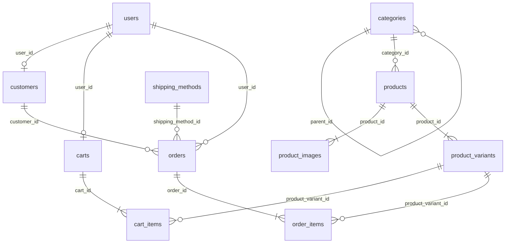

# データベース仕様書（草案）

> **ステータス: 検討中（未実装）**
>
> テーブル定義の詳細は [テーブル定義書](./table-definition.md) を参照。  
> コード・マイグレーションは本仕様が確定するまで作成しない。

## ドキュメント情報

| 項目 | 内容 |
|------|------|
| プロジェクト名 | いおり書房 EC サイト（iorishobo） |
| DBMS | MySQL 8.x |
| 関連ドキュメント | [テーブル定義書](./table-definition.md) |
| バージョン | 0.6（草案） |
| 最終更新日 | 2026-06-22 |

---

## 1. 設計の前提

| 項目 | 方針 |
|------|------|
| 移行元 | カラーミーショップ |
| 商品数 | 約 72 SKU（親商品＋オプション組み合わせ含む） |
| 決済 | Stripe |
| 会員 | ゲスト購入可 + 任意ログイン |
| 配送 | クリックポスト系 / ゆうパック（**全国一律送料**） |
| データ移行 | 商品・顧客・注文を CSV から移行 |
| 旧 URL | カラーミー商品 ID で 301 リダイレクト |
| 金額 | 整数・円単位・税込（小数不使用） |

---

## 2. カラーミーデータの分析

設計は **エクスポート CSV の実データ** に基づく。推測で項目を省略しない。

### 2.1 商品（product.csv）

- 72 行（1 行 = 1 親商品）
- 大カテゴリー / 小カテゴリーの 2 階層
- JAN/ISBN、重量、個別送料、掲載設定など 60 列
- 多くの商品は **在庫管理しない**

### 2.2 オプション（option_csv_download_*.csv）

| パターン | 例 |
|---------|-----|
| 1 軸（学年） | １年生 / ２年生 / ３年生 |
| 2 軸（学年 × 教科書準拠） | １年生 × 東京書籍 |
| 1 軸（科目） | 代数1 / 平面2 |

各選択肢に **独自の colorme_option_id と価格** がある。

### 2.3 顧客（customer.csv）— 実データの確認

| 項目 | サンプル 3 件での空欄 |
|------|---------------------|
| 名前 | 0 / 3 |
| フリガナ | 0 / 3（移行データにはあるが **新規入力では任意**） |
| 郵便番号・都道府県・住所 | 0 / 3 |
| 電話番号 | 1 / 3 |
| 携帯番号 | 1 / 3 |
| FAX | 3 / 3（**常に空 → 新設計では持たない**） |

カラーミーの住所形式:

```
都道府県名: 群馬県          ← 別列
住所:       高崎市下和田町4-4-4   ← 市区町村 + 番地が 1 列に結合
```

別例（建物名あり）:

```
都道府県名: 神奈川県
住所:       横浜市青葉区藤が丘 2-37-10　オトゥール藤が丘 403
```

→ サイト入力は **住所 + 建物名の 2 列** だが、**sales_all.csv / customer.csv では `住所` 1 列に結合** されて出力される（[ヘルプ：受注一括データ](https://help.shop-pro.jp/hc/ja/articles/360062479334)）。  
ヤマト等の配送 CSV では **お届け先住所 + お届け先建物名** が別列。

### 2.5 住所項目の整理（サイト vs CSV）

| レイヤ | 住所の持ち方 |
|--------|-------------|
| **購入フォーム** | 郵便番号 + 都道府県 + **住所（address1）** + **建物名（address2・任意）** |
| **sales_all.csv** | 郵便番号 + 都道府県 + **住所 1 列**（建物名込みで結合されることあり） |
| **customer.csv** | 同上 |
| **ヤマト配送 CSV** | お届け先住所 + お届け先建物名（2 列） |

Laravel の DB 列は **購入フォーム（address1/address2）に合わせる**。city / street への 5 分割は行わない。

---

### 2.4 注文（sales_all.csv）— 実データの確認

| 項目 | 内容 |
|------|------|
| 購入者 | 名前・郵便番号・都道府県・住所・メール・電話・携帯（**フリガナ列なし**） |
| 配送先 | 名前・**フリガナ（任意）**・郵便番号・都道府県・住所・電話 |
| 購入者 ≠ 配送先 | 4 注文中、複数件で **別人・別住所**（例: 購入者 山田一郎 → 配送先 桜井美沙子） |
| 配送先フリガナ | 4 注文中 **3 件が空** → **必須にしない** |
| 備考 | 注文備考（列 33）と配送先備考（列 54）が **別** |
| 消費税 | 列 12 に税額あり |
| デバイス | 列 2（PC / モバイル） |

---

## 3. 設計方針

### 3.1 テーブル構成

```
【マスタ】
  categories
  products
  product_images
  product_variants
  shipping_methods

【顧客・認証】
  users                 ← Laravel 標準（ログイン）
  customers             ← 顧客プロフィール（customer.csv 相当）

【トランザクション】
  carts / cart_items    ← チェックアウト前の買い物かご（新規サイト専用）
  orders                ← 購入者 + 配送先スナップショット（sales_all.csv 相当）
  order_items

【将来追加】
  payments
  saved_addresses       ← 会員の保存配送先（必要になったら。CSV エクスポートなし）
```

### 3.1.1 カート

| 項目 | 方針 |
|------|------|
| テーブル | `carts` / `cart_items` |
| 移行 | **なし**（カラーミー CSV に相当データなし） |
| ゲスト | `carts.session_id` で特定 |
| ログイン | `carts.user_id` で特定（1 ユーザー 1 カート） |
| 明細 | `cart_items.product_variant_id` + `quantity` |
| 単価 | カートには保存しない。チェックアウト時に `product_variants.price` を参照 |
| ログイン時 | ゲストカートをユーザーカートへマージ（アプリ側） |
| 注文確定後 | カート明細を削除（またはカートごと削除） |

### 3.2 配送・送料

| 項目 | 方針 |
|------|------|
| 送料計算 | **全国一律**（都道府県別・重量別の料金表は持たない） |
| 配送方法 | クリックポスト / ゆうパック等、方法ごとに `shipping_methods` 1 レコード |
| 基本送料 | `shipping_methods.base_fee` |
| 送料無料 | `shipping_methods.free_shipping_threshold`（商品合計税込がこの金額以上で 0 円。NULL = なし） |
| 個別送料 | **使わない**（カラーミーの商品別送料は移行対象外） |

### 3.3 商品画像

| 項目 | 方針 |
|------|------|
| 保存先 | `product_images`（1 商品に複数行） |
| メイン画像 | `sort_order = 0` |
| 移行 | product.csv の「商品画像 URL」→ 0、「その他画像 1〜9 URL」→ 1〜9（空欄はスキップ） |

### 3.4 住所の持ち方

カラーミーの **address1 / address2**（住所 + 建物名）に対応する。

| カラム | カラーミー対応 | チェックアウト |
|--------|--------------|--------------|
| postal_code | 郵便番号 | 必須 |
| prefecture | 都道府県 | 必須 |
| address_line1 | 住所（address1） | 必須 |
| address_line2 | 建物名（address2） | **任意** |

| テーブル | 用途 |
|---------|------|
| customers | 顧客マスタ |
| orders | 購入者（buyer_*）・配送先（shipping_*）のスナップショット |

### 3.5 氏名・フリガナの必須/任意

| 項目 | チェックアウト | 根拠 |
|------|--------------|------|
| 氏名 | 必須 | |
| フリガナ | **任意** | 注文 CSV で配送先フリガナ 75% が空 |
| メール | 必須 | 受注確認・Stripe |
| 電話 or 携帯 | **どちらか 1 つ必須** | 顧客 CSV で片方空のケースあり |

氏名はカラーミー互換のため **1 フィールド（`name`）** で開始。  
将来、姓・名分割が必要なら `last_name` / `first_name` へ拡張する。

### 3.6 購入者と配送先（orders）

**sales_all.csv に存在する** ため orders に保持する。カラーミーにない概念は足さない。

```
orders
  ├── buyer_*      … 購入者（CSV: 購入者 名前 / 郵便番号 / 都道府県 / 住所 …）
  └── shipping_*   … 配送先（CSV: 配送先 名前 / フリガナ / 郵便番号 …）
```

| 項目 | sales_all.csv | orders |
|------|--------------|--------|
| 購入者 | あり（フリガナ列なし） | `buyer_*` |
| 配送先 | あり（フリガナ任意） | `shipping_*` |
| 会員の保存配送先 | **CSV なし** | **テーブル不要（将来）** |

### 3.7 商品とバリアント

カラーミー「オプション ID」1 件 = `product_variants` 1 レコード。  
属性（学年・教科書準拠等）は `attributes` JSON の **キー名を軸名** として保持（例: `{"学年":"１年生","教科書準拠":"東京書籍"}`）。  
在庫は **バリアント単位**。`products.stock_managed = true` の商品だけバリアントの `stock` を見る。`false` は在庫チェックしない（移行データの多くはこちら）。

オプションが1つもない商品（単品のみ）は、`product_variants` に **1 行だけ** 登録する（表示名は商品名と同じ、または「標準」など）。

### 3.7.1 会員価格・ポイント

| 機能 | 新規ショップ | 移行 |
|------|------------|------|
| 会員価格 | **使わない**（`member_price` 列は持たない） | 過去注文の実売価格は `order_items.unit_price` に入るため十分 |
| ショップポイント | **使わない** | 過去に使っていれば `orders.point_discount` 等に金額を保存。移行時に 0 ならそのまま 0 |

### 3.8 colorme_* カラム

| テーブル | カラム | NULL | 理由 |
|---------|--------|------|------|
| products | colorme_product_id | **可** | 新規商品は ID なし |
| product_variants | colorme_option_id | **可** | 同上 |
| customers | colorme_customer_id | **可** | 新規顧客は ID なし |
| orders | colorme_sales_id | **可** | 新規注文は ID なし |

`categories` には **colorme_* 列を持たない**。移行時は `product.csv` の大カテゴリー名・小カテゴリー名と `categories.name` を照合し、見つかった `categories.id` を `products.category_id` に入れる。

移行後も旧 ID はリダイレクト・照合用に保持する。

### 3.9 カラーミー移行時の住所

CSV の `住所` 列は address_line1 + address_line2 が **結合された文字列** の場合がある。

移行時は可能な限り分割し、不明な場合は address_line1 に全文を入れる。

### 3.10 過去注文の移行（orders）

`sales_all.csv` の金額・配送列は、**使っていなくても列ごと取り込む**。移行前に CSV を開いて列の有無を確認する必要はない。

| orders 列 | sales_all.csv の列 | 移行時に値がなければ |
|-----------|-------------------|---------------------|
| payment_fee | 決済手数料 | 0 |
| discount | 割引金額 | 0 |
| discount_name | 割引名称 | NULL |
| point_discount | ショップポイントによる割引金額 | 0 |
| external_point_discount | 外部ポイントによる割引金額 | 0 |
| shipping_method_name | 配送先 配送会社名 | NULL |
| shipped_at | 発送日時 | NULL |

新規 Stripe 注文では `payment_fee`・ポイント割引は 0、`discount_name` は NULL でよい。

---

## 4. v0.1 からの修正一覧

| 問題 | v0.1〜0.2 | v0.3 | v0.4 |
|------|-----------|------|------|
| 住所 | city/street/building 5 分割 | **address_line1 + address_line2** | |
| フリガナ | 必須に見える定義 | **任意（NULL 可）** | |
| 購入者 | orders に無かった | `buyer_*` | |
| 配送先フリガナ | 欠落 | `shipping_name_kana` | |
| customer_addresses | 追加していた | **削除** | |
| billing_* | 追加していた | **buyer_* に改名** | |
| 商品画像 | image_path 1 列 | | **product_images テーブル** |
| 送料 | base_fee のみ | | **free_shipping_threshold**（全国一律） |
| 過去注文の金額内訳 | 一部のみ | | v0.5: payment_fee / discount_name / point_discount 等 |
| カート | なし | | v0.6: carts / cart_items |

---

## 5. ER 図



---

## 6. カラーミー CSV との対応

| 本 DB | カラーミー CSV | 備考 |
|-------|---------------|------|
| products | product.csv | colorme_product_id |
| product_images | product.csv 画像列 | sort_order 0 = メイン、1〜9 = その他画像 |
| product_variants | option_csv_*.csv | colorme_option_id |
| shipping_methods | 管理画面の配送方法設定 | base_fee + free_shipping_threshold |
| customers | customer.csv | 住所は分割して取り込み |
| orders.buyer_* | sales_all 購入者列 | フリガナ列なし |
| orders.shipping_* | sales_all 配送先列 | フリガナは任意 |
| order_items | sales_all 明細列 | |

---

## 7. 未決事項

| No | 論点 | 選択肢 |
|----|------|--------|
| 1 | 氏名 | 1 フィールド継続 / 姓・名分割 |
| 2 | 住所移行 | 自動パース / 手修正併用 |

---

## 8. 改訂履歴

| バージョン | 日付 | 内容 |
|-----------|------|------|
| 0.1 | 2026-06-21 | 初版草案 |
| 0.2 | 2026-06-21 | CSV 実データに基づき必須項目等を修正 |
| 0.3 | 2026-06-21 | 住所を address_line1/2 に修正。customer_addresses 削除。buyer_* に統一 |
| 0.4 | 2026-06-22 | product_images 追加。送料全国一律 + 送料無料ライン。在庫はバリアント単位を明記 |
| 0.5 | 2026-06-22 | orders に移行用金額列追加。会員価格・ポイントは新規不使用を明記 |
| 0.5.1 | 2026-06-22 | categories に colorme_* は持たない方針を明記 |
| 0.6 | 2026-06-22 | carts / cart_items 追加 |
